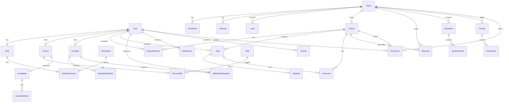

# Build8 Database ERD

## Entity Relationship Diagram

## Core Tables

### Auth & RBAC

| Table | Purpose | Key Fields |
|-------|---------|------------|
| `users` | System users | email, passwordHash, roleId, status |
| `roles` | Role definitions | name, slug, isSystem |
| `permissions` | Granular permissions | slug, module, action |
| `role_permissions` | Role-permission mapping | roleId, permissionId |
| `accounts` | OAuth accounts (Auth.js) | provider, providerAccountId |
| `sessions` | Active sessions | sessionToken, expires |
| `verification_tokens` | Password reset tokens | identifier, token, expires |

### CRM

| Table | Purpose | Key Fields |
|-------|---------|------------|
| `clients` | Client companies | companyName, status, contactPerson |
| `client_notes` | Client notes | clientId, authorId, content |
| `meetings` | Meeting history | clientId, date, title |
| `leads` | Sales pipeline | name, stage, source |

### Project Management

| Table | Purpose | Key Fields |
|-------|---------|------------|
| `projects` | Client projects | name, clientId, status, budget, deadline |
| `project_members` | Team assignments | projectId, userId, role |
| `tasks` | Work items | title, priority, status, assigneeId |
| `subtasks` | Task breakdown | taskId, title, completed |
| `comments` | Project/task comments | content, authorId |

### People

| Table | Purpose | Key Fields |
|-------|---------|------------|
| `people` | All people records | fullName, status, position, salary |
| `skills` | Skill catalog | name |
| `person_skills` | Person-skill mapping | personId, skillId, level |
| `candidates` | Hiring pipeline | personId, stage, cvUrl |
| `candidate_notes` | Interview notes | candidateId, content |

### Finance

| Table | Purpose | Key Fields |
|-------|---------|------------|
| `revenues` | Income records | amount, clientId, projectId, date |
| `expenses` | Expense records | amount, category, date |
| `founders` | Founder equity | name, equityPercent |
| `equity_distributions` | Monthly distributions | netProfit, founderShare, reserveShare |
| `withdrawal_requests` | Founder withdrawals | amount, status |

### Documents & Billing

| Table | Purpose | Key Fields |
|-------|---------|------------|
| `quotations` | Client quotes | number, clientId, total, status |
| `quotation_items` | Quote line items | description, quantity, unitPrice |
| `invoices` | Client invoices | number, clientId, total, status, dueDate |
| `invoice_items` | Invoice line items | description, quantity, unitPrice |
| `documents` | File storage | name, fileUrl, category, folderPath |

### System

| Table | Purpose | Key Fields |
|-------|---------|------------|
| `notifications` | In-app alerts | userId, type, title, read |
| `activities` | Audit feed | type, title, actorId, metadata |
| `settings` | App configuration | key, value (JSON) |

## Key Relationships

- **User → Role**: Every user has exactly one role
- **User → Founder**: Optional link for founder accounts
- **Client → Project**: One client, many projects
- **Project → Task**: One project, many tasks (tasks can be standalone)
- **Person → Candidate**: One-to-one for hiring pipeline
- **Revenue/Expense → Equity**: Aggregated for profit distribution
- **Founder → EquityDistribution**: Monthly profit share records

## Indexes

Critical indexes for query performance:

- `users.email`, `users.roleId`, `users.status`
- `clients.companyName`, `clients.status`
- `leads.stage`, `projects.status`, `projects.deadline`
- `tasks.assigneeId`, `tasks.status`, `tasks.dueDate`
- `revenues.date`, `expenses.date`, `expenses.category`
- `invoices.status`, `invoices.dueDate`
- `notifications.userId + read`
- `activities.createdAt`

## Enums Summary

| Enum | Values |
|------|--------|
| ClientStatus | LEAD, PROSPECT, ACTIVE, INACTIVE |
| LeadStage | NEW → CONTACTED → MEETING_SCHEDULED → PROPOSAL_SENT → NEGOTIATION → WON/LOST |
| ProjectStatus | PLANNING, ACTIVE, REVIEW, COMPLETED, CANCELLED |
| TaskPriority | LOW, MEDIUM, HIGH, CRITICAL |
| TaskStatus | TODO, IN_PROGRESS, REVIEW, DONE |
| PersonStatus | CANDIDATE, ACTIVE, ON_HOLD, FREELANCER, FORMER_MEMBER |
| CandidateStage | NEW → CONTACTED → INTERVIEW → TECHNICAL_TEST → ACCEPTED/REJECTED/HIRED |
| ExpenseCategory | MARKETING, HOSTING, DOMAINS, SOFTWARE, SALARIES, OPERATIONS, OTHER |
| InvoiceStatus | DRAFT, SENT, PAID, OVERDUE, CANCELLED |
| QuotationStatus | DRAFT, SENT, ACCEPTED, REJECTED |
